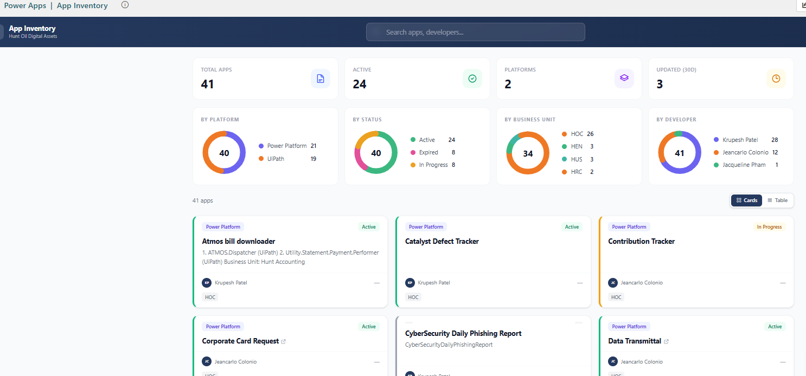
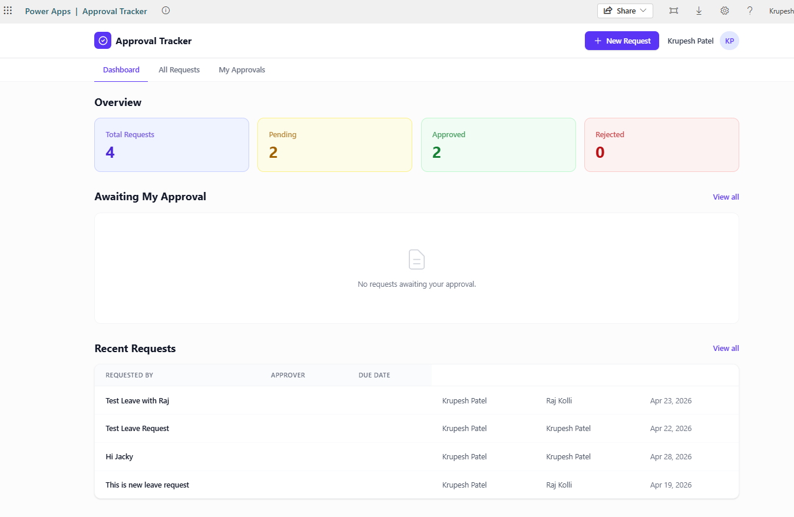

# ClaudeSkills

A Claude Code [plugin marketplace](https://docs.claude.com/en/docs/claude-code/plugin-marketplaces) of opinionated, production-tested skills.

Each plugin packages a Claude [skill](https://docs.claude.com/en/docs/claude-code/skills) — domain knowledge, workflows, and templates Claude loads on demand to extend its behavior without modifying the model.

---

## Install the marketplace

In Claude Code:

```bash
/plugin marketplace add Krupesh9/ClaudeSkills
```

Then browse and install any plugin:

```bash
/plugin install powerapps-codeapp-setup@claudeskills
```

Or skip the marketplace and install a plugin directly from the repo:

```bash
/plugin install https://github.com/Krupesh9/ClaudeSkills/tree/main/powerapps-codeapp-setup
```

---

## Plugins in this marketplace

### powerapps-codeapp-setup

Scaffold a complete, deployable Power Apps Code App from a short interactive intake. Generates the full React + TypeScript + Vite + Tailwind skeleton, wires up SharePoint / Office 365 Users / Outlook connectors, and walks you through `pac auth → npm run setup → npm run connect → npm run push`. Encodes the silent-failure gotchas around SharePoint Choice and Person field writes that cost real engineering hours to discover.

**Reference apps built with these patterns:**





> **Reference repo:** [github.com/Krupesh9/CodeApps](https://github.com/Krupesh9/CodeApps) — source for App Inventory Tracker and Approval Tracker.

```bash
/plugin install powerapps-codeapp-setup@claudeskills
```

[→ Open the plugin](powerapps-codeapp-setup/)

**Triggers on:** `/setup`, "build me a code app", "scaffold a Power Apps code app", "wire up SharePoint", "connect to Dataverse / Office 365".

---

### the-honest-astrologer (skill, plugin packaging in progress)

Acts as a senior Vedic astrologer with 50+ years of experience giving grounded, plain-language readings on career, wealth, love, marriage, family, health, and education. Generates production-quality birth chart visuals in four styles (Western circular, North Indian diamond, South Indian square, Chinese zodiac), supports compatibility checking between two people, and exports readings as PDF reports.


**Sample chart outputs:**

- [Western circular](the-honest-astrologer-skill/examples/sample-chart-western.png)
- [North Indian diamond](the-honest-astrologer-skill/examples/sample-chart-north-indian.png)
- [South Indian square](the-honest-astrologer-skill/examples/sample-chart-south-indian.png)
- [Chinese zodiac](the-honest-astrologer-skill/examples/sample-chart-chinese-zodiac.png)

[→ Open the skill](the-honest-astrologer-skill/)

For now, install manually:

```bash
git clone https://github.com/Krupesh9/ClaudeSkills.git
cp -r ClaudeSkills/the-honest-astrologer-skill ~/.claude/skills/
```

**Triggers on:** astrology reading, kundali analysis, birth chart, horoscope, marriage compatibility, kundali matching, Chinese zodiac.

---

## Repository structure

```text
ClaudeSkills/
├── .claude-plugin/
│   └── marketplace.json              # Marketplace listing (one entry per plugin)
├── powerapps-codeapp-setup/          # Plugin folder
│   ├── .claude-plugin/
│   │   └── plugin.json               # Plugin manifest
│   ├── README.md                     # Plugin-level docs (install + overview)
│   └── skills/
│       └── powerapps-codeapp-setup/
│           ├── SKILL.md
│           ├── BLUEPRINT.md          # Quick reference
│           ├── blueprint/
│           │   └── POWERAPP-CODE-APP-BLUEPRINT.md   # Canonical full blueprint
│           ├── templates/
│           ├── checklists/
│           └── examples/
├── the-honest-astrologer-skill/      # Standalone skill (not yet plugin-packaged)
│   ├── SKILL.md
│   ├── examples/
│   └── scripts/
├── README.md                         # This file
└── LICENSE
```

## Manual install (without `/plugin`)

For environments without the plugin manager, copy any skill folder into your skills directory:

```bash
git clone https://github.com/Krupesh9/ClaudeSkills.git

# Plugin-packaged skill (note the nested skills/ folder)
cp -r ClaudeSkills/powerapps-codeapp-setup/skills/powerapps-codeapp-setup ~/.claude/skills/

# Standalone skill
cp -r ClaudeSkills/the-honest-astrologer-skill ~/.claude/skills/
```

## Contributing

Skills and plugins in this repository are works in progress. Open an issue or PR with suggestions.

## License

Released under the [MIT License](LICENSE).
