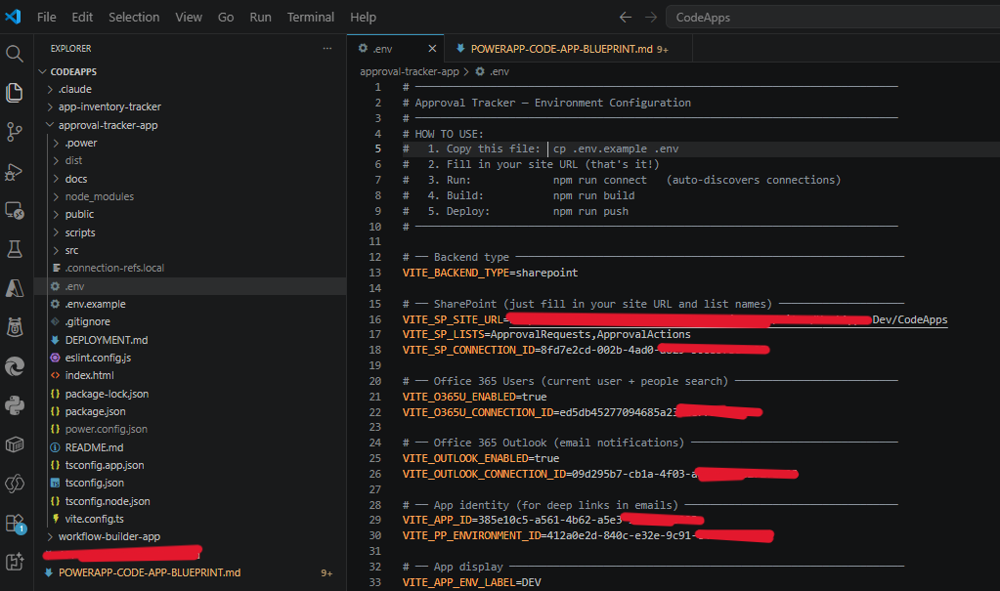

# powerapps-codeapp-setup

[](https://docs.claude.com/en/docs/claude-code/plugins) [](../LICENSE)

A Claude Code plugin that scaffolds a complete, deployable Power Apps Code App from a short interactive intake — React + TypeScript + Vite + Tailwind, wired to SharePoint / Office 365 Users / Outlook, deployable via `npm run push`.

Encodes the silent-failure gotchas around SharePoint Choice and Person field writes that cost real engineering hours to discover.

---

## Quick install

### Option 1 — Marketplace (recommended)

```bash
# In Claude Code:
/plugin marketplace add Krupesh9/ClaudeSkills
/plugin install powerapps-codeapp-setup@claudeskills
```

### Option 2 — Direct from GitHub

```bash
/plugin install https://github.com/Krupesh9/ClaudeSkills/tree/main/powerapps-codeapp-setup
```

### Option 3 — Manual (skill only, no plugin manager)

```bash
# Clone and copy the skill folder into your skills dir
git clone https://github.com/Krupesh9/ClaudeSkills.git
cp -r ClaudeSkills/powerapps-codeapp-setup/skills/powerapps-codeapp-setup ~/.claude/skills/
```

After install, invoke with `/setup` — or just say "build me a Power Apps code app" and Claude will route to it automatically.

---

## What it does

When you invoke the skill, Claude will:

1. **Read the canonical blueprint** at `skills/powerapps-codeapp-setup/blueprint/POWERAPP-CODE-APP-BLUEPRINT.md` — every gotcha, every reusable pattern.
2. Walk you through a **structured intake** — project name, environment, SharePoint lists, columns, connectors, features.
3. **Draft a written plan** referencing the blueprint, then confirm it with you.
4. Generate the **full project skeleton**: `package.json`, Vite + Tailwind config, `src/config.ts`, `dataService.ts`, hooks, store, components, scripts.
5. Walk you through the **CLI commands**: `pac auth create`, `npm run setup`, `npm run connect`, `npm run build && npm run push`.
6. Offer **add-on recipes**: People Picker, email notifications, deep linking, parent-child lists, environment promotion.

---

## The `npm run connect` magic

The flagship feature: a smart auto-connect script that discovers Power Platform connections via `pac connection list`, prompts you to pick one per connector, runs `npx power-apps add-data-source` for every list and resource you defined, and writes the connection IDs back to `.env`.


The result — every connection ID populated in `.env`, ready to build and push:



---

## What you can build with it

Two real production apps shipped at Hunt Oil, both scaffolded with these patterns:

### Approval Tracker — parent-child lists, People Picker, email notifications


### App Inventory — interactive donut filters, card grid, KPI stats


> **Reference repo:** [github.com/Krupesh9/CodeApps](https://github.com/Krupesh9/CodeApps) — source for both apps. The templates in this skill are direct extractions from there.

---

## Plugin layout

```text
powerapps-codeapp-setup/
├── .claude-plugin/
│   └── plugin.json                   # Plugin manifest
├── README.md                         # This file
└── skills/
    └── powerapps-codeapp-setup/
        ├── SKILL.md                  # The skill — workflow, intake, key patterns
        ├── BLUEPRINT.md              # Quick-reference gotcha list
        ├── README.md                 # Skill-level README
        ├── blueprint/
        │   └── POWERAPP-CODE-APP-BLUEPRINT.md   # CANONICAL full blueprint
        ├── templates/                # Drop-in project files
        ├── checklists/               # Phase checklists
        └── examples/                 # Reference screenshots
```

---

## Conventions enforced

- React 18 + TypeScript strict mode + Vite 6
- Tailwind CSS only (no CSS modules, no MUI / Ant Design)
- TanStack Query for SharePoint data
- Zustand for client UI state
- `npx power-apps` (not `pac code`) for all code-app commands
- Choice fields written as `{ Value: "..." }` on UPDATE
- Person fields written with only `@odata.type` + `Claims`
- Verification reads after every write (silent-failure protection)
- `import.meta.env` only in `src/config.ts`
- Connection IDs live in `.env` only — never hardcoded
- Fire-and-forget notifications with `.catch(() => {})`

---

## License

[MIT](../LICENSE) · Copyright (c) 2026 Krupesh Patel
