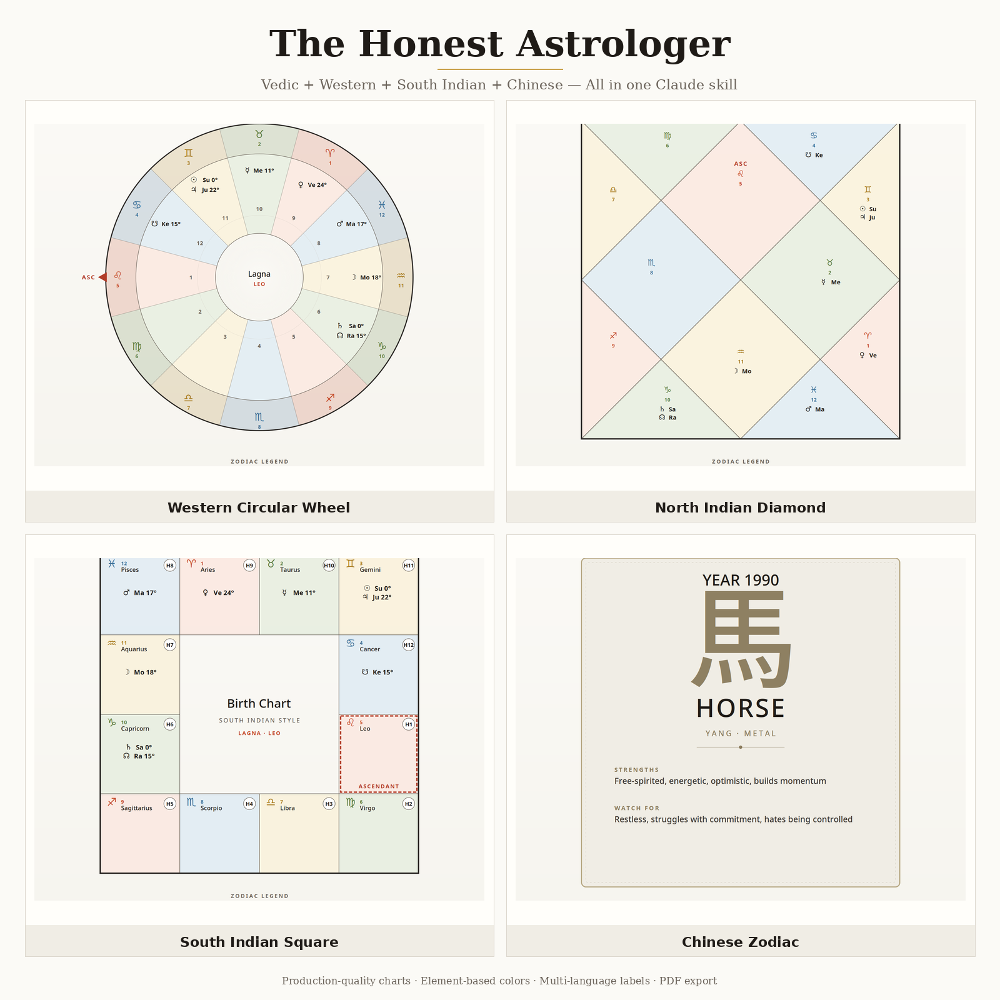

# the-honest-astrologer

[](https://docs.claude.com/en/docs/claude-code/plugins) [](PROMPT.md) [](../LICENSE)

A senior Vedic astrologer with 50+ years of grounded, plain-language wisdom. Generates real birth chart visuals (Western circular, North Indian diamond, South Indian square), runs full kundali matching (Ashtakoota + Manglik + Dasha + planetary friendship), and ends every reading with a reality-check section so you can verify it against your real life.

Refuses medical, legal, crisis, and harm-related questions — kindly, with a redirect.



---

## Two ways to use it

### 🚀 Option A — Just paste a prompt (zero install)

Don't want to install anything? **[Open PROMPT.md](PROMPT.md)** — paste-ready system prompts for:

- **Gemini Gem** (Google Gemini)
- **Claude Project** (claude.ai)
- **ChatGPT Custom GPT**
- **Claude Code** (one-shot)
- **Any LLM** (first-message version)

You get the full reading + reasoning experience. The Python chart scripts only run with the installable plugin (Option B), but the model will still describe charts in words.

### 🔧 Option B — Install as a Claude Code plugin

For real chart computation (pyswisseph + Lahiri ayanamsa) and PNG/PDF rendering:

```bash
# In Claude Code:
/plugin marketplace add Krupesh9/ClaudeSkills
/plugin install the-honest-astrologer@claudeskills
```

Or directly:

```bash
/plugin install https://github.com/Krupesh9/ClaudeSkills/tree/main/the-honest-astrologer-skill
```

Or manual:

```bash
git clone https://github.com/Krupesh9/ClaudeSkills.git
cp -r ClaudeSkills/the-honest-astrologer-skill/skills/the-honest-astrologer ~/.claude/skills/
```

Once installed, just say: *"Can you do an astrology reading for me?"* — Claude routes to the skill automatically.

---

## What you get

- **Asks first, reads second** — birth details, your actual question, then 2-4 clarifying questions before any analysis
- **Plain-language delivery** — no Sanskrit dump, just what the chart suggests in your life
- **Calibrated confidence** — "the chart strongly suggests" vs "this could go either way"
- **Reality-check section** at the end of every reading — 3-4 things to observe over 1-6 months
- **Three chart styles** — Western circular wheel (default, element-based colors), North Indian diamond, South Indian square
- **Optional Chinese zodiac** add-on for cross-cultural compatibility readings
- **Full kundali matching** with Ashtakoota / Guna Milan, Manglik check, Dasha compatibility, planetary friendship — framed as workable conditions, never pass/fail
- **PDF export** for the full reading

---

## Sample chart styles

| Style                | Best for                | Sample                                                                        |
| -------------------- | ----------------------- | ----------------------------------------------------------------------------- |
| Western circular     | Modern look, default    | [view](skills/the-honest-astrologer/examples/sample-chart-western.png)        |
| North Indian diamond | North India / diaspora  | [view](skills/the-honest-astrologer/examples/sample-chart-north-indian.png)   |
| South Indian square  | South India / Sri Lanka | [view](skills/the-honest-astrologer/examples/sample-chart-south-indian.png)   |
| Chinese zodiac card  | Cross-cultural readings | [view](skills/the-honest-astrologer/examples/sample-chart-chinese-zodiac.png) |

---

## Plugin layout

```text
the-honest-astrologer-skill/
├── .claude-plugin/
│   └── plugin.json                # Plugin manifest
├── README.md                      # This file
├── PROMPT.md                      # Copy-paste prompts (Gemini, Claude, ChatGPT, generic)
└── skills/
    └── the-honest-astrologer/
        ├── SKILL.md               # The skill — persona, conversation flow, guardrails
        ├── README.md              # Skill-level overview
        ├── the-honest-astrologer-preview.png
        ├── examples/              # Sample chart outputs (PNG + PDF)
        └── scripts/
            ├── compute_chart.py   # Vedic chart computation (Lahiri, whole-sign, Vimshottari Dasha)
            ├── chart_renderer.py  # SVG/PNG/PDF rendering in 4 styles
            └── compatibility.py   # Ashtakoota + Manglik + Dasha + planetary friendship
```

The Python scripts use **pyswisseph** (Swiss Ephemeris) for real planetary computations. They need fonts: Noto CJK, Noto Devanagari, DejaVu Sans (graceful fallbacks if missing).

---

## Why "honest"?

Because most astrology marketing is built on flattery, fear, or expensive remedies. This one isn't.

- **No exact dates** for life events — just "the chart strongly suggests" and rough windows
- **No pass/fail kundali matches** — couples with 30+ Ashtakoota scores divorce; couples with 18 build wonderful 50-year marriages
- **No "Manglik = death curse"** — that framing has caused enormous harm to real marriages and is not supported by any honest reading of the texts
- **No fixed fate** — astrology is a mirror, not a map. Two people with the same chart live very different lives based on choices, effort, and circumstances

The reading ends with **"How to test this in your real life"** — concrete things you can observe over 1-6 months. If it lines up, the reading was useful. If it doesn't, throw it away.

---

## License

[MIT](../LICENSE) · Copyright (c) 2026 Krupesh Patel
